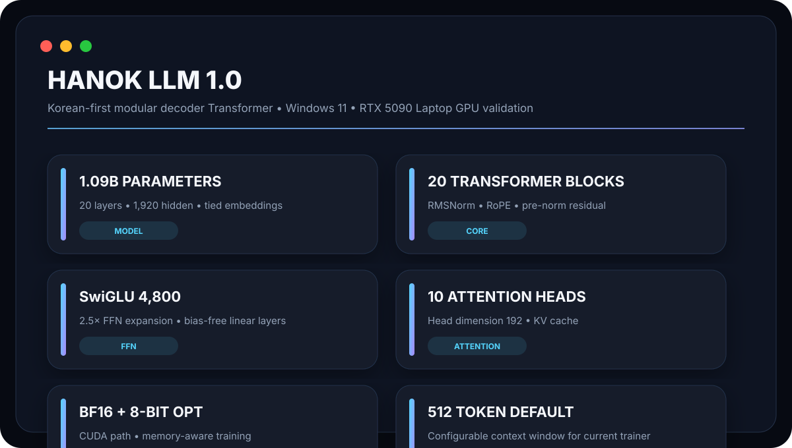
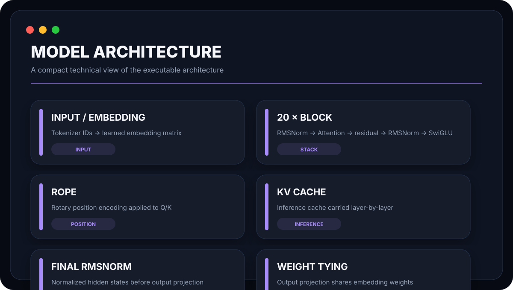
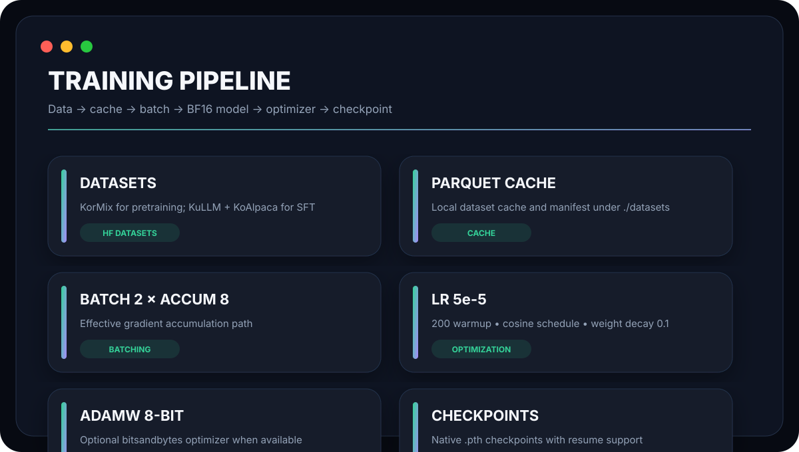
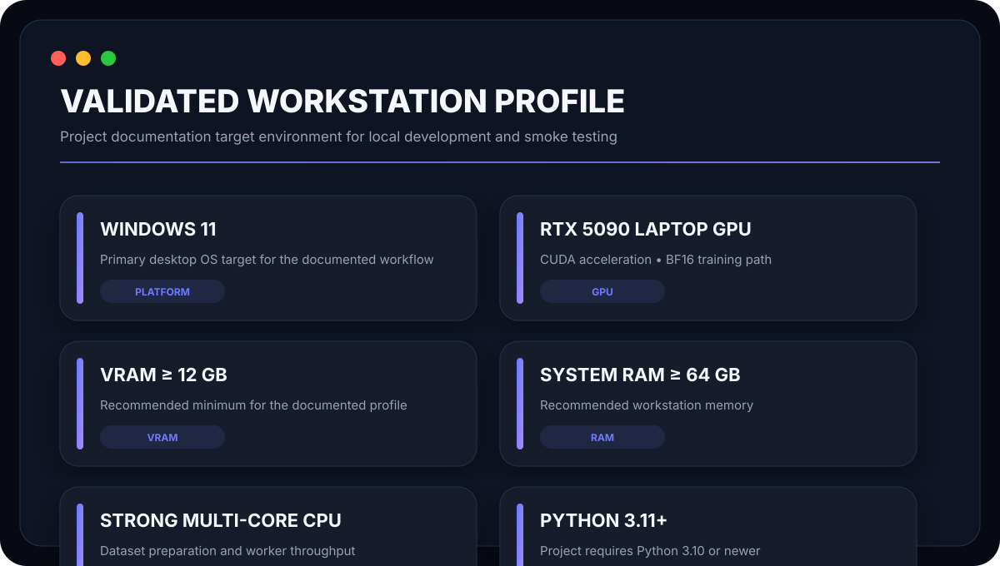
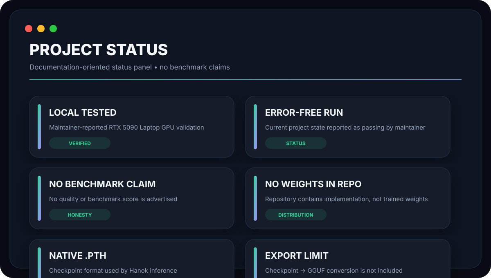
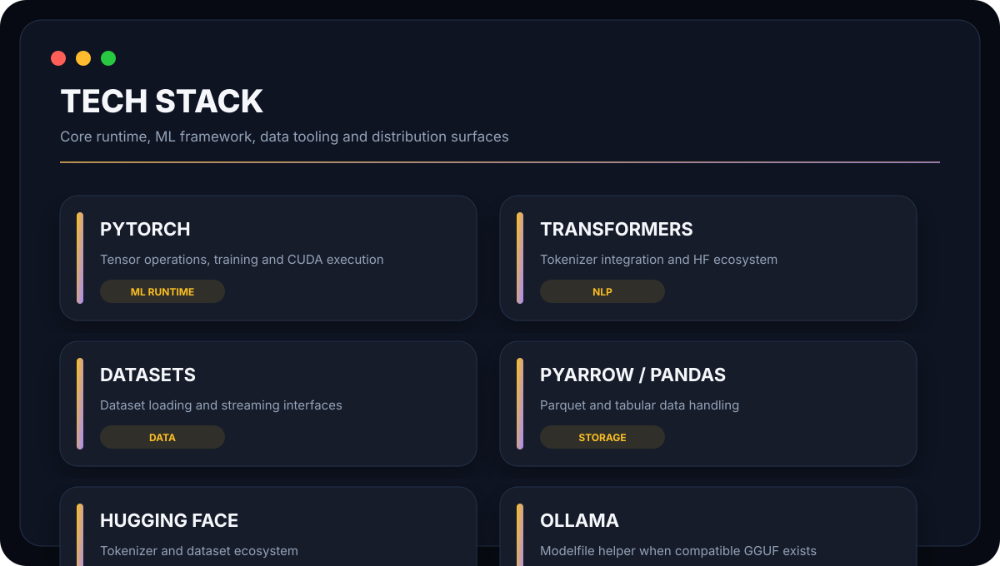

<div align="center">

# 🏯 Hanok LLM 1.0

### Korean-first modular language model stack

🌐 **Languages:** [English](README.md) · [한국어](README.ko.md)

**A clean, native PyTorch Transformer implementation for Korean LLM experimentation, training, inference, checkpointing and data workflows — built for commercialization.**

<p align="center">
  
  
  
  
  
  
  
</p>



<p>
  <b>20 Layers</b> · <b>1,920 Hidden</b> · <b>10 Heads</b> · <b>SwiGLU 4,800</b> · <b>~1.09B Parameters</b>
</p>

**Repository:** [https://github.com/seoan1024/Hanok-LLM.git](https://github.com/seoan1024/Hanok-LLM.git)  
**Research base:** [https://github.com/seoan1024/Korean-llm.git](https://github.com/seoan1024/Korean-llm.git)

</div>

---

## ✦ What is Hanok?

Hanok LLM is built on the foundation of continuous research from the [Korean-llm](https://github.com/seoan1024/Korean-llm.git) project.  
It is a modular, production-oriented Korean language model stack designed with **full commercialization** as the clear and explicit goal.

The entire system lives under a maintainable Python package (`src/hanok/`) with strict separation of concerns. Every major subsystem — model, data, training, inference, evaluation, export and monitoring — can be inspected, extended or replaced independently.

| Layer | Responsibility |
|:------|:---------------|
| **Model** | Native decoder-only Transformer (`KoreanLLM`) with RMSNorm, RoPE, SwiGLU, tied embeddings and KV cache |
| **Data** | Hugging Face dataset loading, Parquet caching, Korean-oriented field parsing and response-only SFT masking |
| **Training** | Pretrain → SFT orchestration, gradient accumulation, cosine schedule, checkpoint resume, optional GUI |
| **Inference** | Native `.pth` loading + temperature / top-k / top-p / repetition-penalty generation |
| **Evaluation** | Perplexity and a reproducible Korean multiple-choice regression benchmark |
| **Export** | Standard Transformers Llama bundle, llama.cpp GGUF, and Ollama model creation |
| **UI** | Optional real-time training monitor GUI |

> **Build a Korean LLM stack you can actually inspect — and ship.**  
> Native PyTorch. Explicit defaults. Local checkpoints. Practical Windows + CUDA workflow.

Trained model weights are not included. Export commands convert a checkpoint supplied by the user.

---

## 🧠 Architecture in depth



### Core configuration

| Parameter                    | Value                          | Notes |
|:-----------------------------|:------------------------------:|:------|
| Transformer blocks           | **20**                         | `n_layers` |
| Hidden dimension             | **1,920**                      | `dim` |
| Attention heads              | **10**                         | `n_heads` |
| Head dimension               | **192**                        | `dim // n_heads` |
| SwiGLU intermediate          | **4,800**                      | `dim × 2.5` |
| Normalization                | **RMSNorm**                    | `eps=1e-6` |
| Positional encoding          | **RoPE**                       | θ = 10,000 |
| Residual style               | **Pre-norm**                   | Attention & FFN |
| Embedding / output           | **Tied weights**               | `output.weight = embed.weight` |
| KV cache                     | **Supported**                  | Per-layer, detached |
| Default training seq length  | **1,024**                      | `TrainingConfig.max_seq_len`; configurable |
| Direct model constructor     | **4,096**                      | `KoreanLLM(max_seq_len=4096)` default RoPE table length |
| Training / CLI context       | **1,024**                      | Training, inference, evaluation, and export defaults |
| Vocab size (default)         | **128,256**                    | Follows loaded tokenizer |
| Instantiated parameters      | **~1.09B**                     | Depends on final vocab size |

The sequence limit is the RoPE table length allocated for that model instance, not a fixed architecture-wide ceiling. The `KoreanLLM` constructor defaults to 4,096 tokens, while the training and CLI loading paths default to 1,024; pass a larger `--max-seq-len` to configure a longer context. Generation counts the prompt and new tokens together, truncates an overlong prompt from the left, and stops at the configured context limit. Context lengths above 1,024 are configurable but are not the default training length and have not been validated for quality here; memory use also grows with sequence length.

### Building blocks

**RMSNorm**  
Root-mean-square normalization without mean centering. Lightweight and stable for deep residual stacks.

**RoPE (Rotary Positional Embeddings)**  
Applied to both queries and keys. Precomputed cosine/sine tables are registered as buffers and sliced by absolute position (supports KV-cache incremental decoding).

**Attention**  
- Multi-head self-attention with `F.scaled_dot_product_attention`  
- Causal masking by default (`is_causal=True` when no external mask is given)  
- Optional external attention mask  
- KV cache concatenation along the sequence dimension for efficient generation

**SwiGLU Feed-Forward**  
Three linear projections (`w1`, `w2`, `w3`) with no bias:  
`w2(SiLU(w1(x)) * w3(x))`. Intermediate size is `dim × 2.5 = 4,800`.

**TransformerBlock**  
Pre-norm residual:  
`x = x + Attention(RMSNorm(x))`  
`x = x + SwiGLU(RMSNorm(x))`

**KoreanLLM**  
- Embedding → 20 × TransformerBlock → final RMSNorm → tied output projection  
- Weight initialization: normal(std=0.02) for Linear and Embedding  
- Training path uses `torch.utils.checkpoint` (non-reentrant) for memory efficiency  
- Loss: token-level cross-entropy with `ignore_index=-100`, reduced by valid target count (handles empty-target batches safely)

### Design philosophy

The architecture deliberately stays close to modern decoder-only practices (RMSNorm + RoPE + SwiGLU + tied embeddings) while remaining fully transparent. There are no opaque custom CUDA kernels or closed-source components — every tensor operation is visible in pure PyTorch.

---

## ⚡ Training stack



### Default `TrainingConfig`

```text
stage                      auto | pretrain | sft
batch_size                 2
accumulation_steps         8          # effective batch = 16
learning_rate              5e-5
sft_learning_rate          1.5e-5
warmup_steps               200
scheduler                  Cosine
weight_decay               0.1
max_steps                  100,000    # manual-stage default
pretrain_steps             100,000
sft_steps                  10,000
eval_interval              5,000
max_seq_len                1024
num_workers                4
use_bfloat16               True
use_8bit_optimizer         True       # AdamW8bit → AdamW fallback
validation_split           0.02
validation_batches         32
enable_gui                 True
seed                       42
checkpoint_dir             checkpoints
force_redownload           False
stream_datasets            False
samples_per_dataset        None
resume_from_checkpoint     None
```

### Training stages

```text
                    ┌──────────────────┐
                    │   DATA SOURCES   │
                    └────────┬─────────┘
                             │
                    ┌────────▼─────────┐
                    │ CACHE / PARQUET  │
                    └────────┬─────────┘
                             │
                 ┌───────────▼───────────┐
                 │       PRETRAIN        │
                 │  KorMix / custom data │
                 │  (100k steps default) │
                 └───────────┬───────────┘
                             │ checkpoint
                 ┌───────────▼───────────┐
                 │          SFT          │
                 │ KuLLM + KoAlpaca      │
                 │ (10k steps default)   │
                 │ response-only labels  │
                 └───────────┬───────────┘
                             │
                    ┌────────▼────────┐
                    │  NATIVE .PTH    │
                    └─────────────────┘
```

- **`auto` mode**: runs full pretraining first, then starts SFT from the latest pretrain checkpoint (fresh optimizer & schedule for SFT).  
- **Checkpoint resume**: supported for both stages.  
- **SFT label masking**: only response tokens contribute to the loss; prompt tokens are set to `-100`.  
- **Pretraining packing**: complete documents are joined into full 1,024-token blocks; Parquet rows are shuffled within row groups to reduce repeated reads.
- **SFT updates**: rank-8 LoRA adapters train while the pretrained base weights stay frozen. Native checkpoints retain the adapters; HF export merges them into the base layers.
- **Validation**: pretraining holds out about 2% by Parquet row group; SFT uses a 2% random split. Evaluated every `eval_interval` steps (up to `validation_batches`).
- **GUI**: optional real-time loss monitor (`enable_gui=True` by default; disable with `--no-gui`).

### Optimizer & scheduler

- Primary: **AdamW8bit** (bitsandbytes) when available  
- Fallback: standard **AdamW**  
- Learning-rate schedule: **Cosine annealing with linear warmup** (200 steps)

### Memory & precision

- BF16 autocast on CUDA when `use_bfloat16=True`  
- Gradient checkpointing active during training  
- Pin memory for DataLoader on CUDA devices
- SFT uses rank-8 LoRA adapters, reducing trainable parameters and optimizer memory.

---

## 🖥️ Recommended workstation



| Component     | Recommended profile                                      |
|:--------------|:---------------------------------------------------------|
| OS            | **Windows 11**                                           |
| GPU           | **NVIDIA GeForce RTX Series** |
| VRAM          | **24 GB+ recommended** (estimated pretraining use: 18–21 GB) |
| System RAM    | **64 GB+**                                               |
| CPU           | High-performance multi-core                              |
| Python        | **3.10+** (documented on 3.11)                           |
| Precision     | **BF16** on supported CUDA hardware                      |
| Storage       | Fast SSD (datasets + checkpoints grow quickly)           |

> **Memory note**  
> With sequence length 1,024, default batch size and accumulation, FP32 model weights with BF16 autocast, AdamW8bit, and gradient checkpointing, peak pretraining VRAM is **estimated at 18–21 GB**. This is an estimate, not a measured result; GPU model and CUDA allocation state affect actual usage. LoRA SFT has a different memory profile.
> Actual usage also depends on batch size, sequence length, optimizer state, whether gradient checkpointing is active, and whether you are training or only running inference.
> Longer sequences or larger effective batches will require more VRAM or reduced accumulation.

---

## 🧪 Validation & roadmap status



| Claim                                              | Status |
|:---------------------------------------------------|:------:|
| Local Windows 11 / RTX 5090 Laptop GPU testing     | ✅     |
| Model construction & native inference              | ✅     |
| Training / checkpoint / resume workflow            | ✅     |
| Architecture / data / move-parity tests            | ✅     |
| Model Card & Data Card included                    | ✅     |
| Commercialization as the explicit goal             | ✅     |
| Trained weights + official benchmark scores        | 🔜 Release |
| Transformers Llama export code                     | ✅ Included |
| llama.cpp GGUF / Ollama export code                | ✅ Included; external tools required |
| Official Korean quality benchmark results          | Not run |

---

## 🧩 Technology stack



| Category          | Libraries / tools                                      |
|:------------------|:-------------------------------------------------------|
| Core              | Python 3.10+, PyTorch 2.x                              |
| Tokenization      | Hugging Face Transformers (`beomi/Llama-3-Open-Ko-8B`) |
| Data              | Hugging Face Datasets, PyArrow, Pandas                 |
| Optimization      | bitsandbytes (optional 8-bit AdamW)                    |
| Monitoring        | matplotlib + optional GUI monitor                      |
| Packaging         | setuptools, `pyproject.toml`, CLI entrypoint `hanok`   |

---

## 📦 Project structure

```text
Hanok-LLM/
├── src/hanok/
│   ├── model/
│   │   └── architecture.py          # KoreanLLM (RMSNorm · RoPE · SwiGLU · KV cache)
│   ├── data/
│   │   └── legacy.py                # DatasetManager, LocalKoreanDataset, collate, Parquet cache
│   ├── training/
│   │   ├── config.py                # TrainingConfig dataclass (all defaults)
│   │   ├── trainer.py               # Main orchestration (auto / pretrain / sft)
│   │   ├── optimizer.py             # AdamW / AdamW8bit selection
│   │   ├── scheduler.py             # Cosine + warmup
│   │   ├── checkpoint.py            # Save / load / find_latest
│   │   └── reproducibility.py       # Seed & distributed helpers
│   ├── inference/
│   │   ├── loader.py                # Checkpoint + tokenizer loading
│   │   └── generation.py            # Autoregressive generation with KV cache
│   ├── evaluation/
│   │   ├── perplexity.py
│   │   ├── benchmark.py
│   │   └── benchmark_ko.jsonl       # local sanity suite, not an official score
│   ├── export/
│   │   ├── huggingface.py           # Map Hanok weights to standard Transformers Llama
│   │   └── ollama.py                # llama.cpp GGUF conversion, Modelfile and Ollama creation
│   ├── ui/
│   │   └── monitor.py               # Optional training GUI
│   └── cli.py                       # `hanok` entrypoint (train / infer)
├── assets/svg/                      # README visual kit
├── MODEL_CARD.md
├── DATA_CARD.md
├── CONTRIBUTING.md
├── SECURITY.md
├── pyproject.toml
└── requirements.txt
```

---

## 🛠️ Installation (Windows 11)

```powershell
# 1. Create / activate a Python 3.10+ environment
python --version

# 2. Install PyTorch with the CUDA build that matches your driver
#    → https://pytorch.org (select CUDA version carefully)

# 3. Install the project in editable mode
python -m pip install -e .

# 4. Optional: 8-bit optimizer support
python -m pip install -e ".[8bit]"

# 5. Verify the CLI is available
hanok --help
```

### Dependencies (from `requirements.txt` / `pyproject.toml`)

```text
torch
transformers
datasets
accelerate
bitsandbytes          # optional, for 8-bit AdamW
pyarrow
pandas
requests
tqdm
matplotlib
setuptools
wheel
```

---

## 🎯 Quick start

### SFT (start from a pretrained checkpoint)

```powershell
hanok train --stage sft --resume-from-checkpoint checkpoints/pretrain/hanok_llm_10000.pth --no-gui
```

### Pretraining

```powershell
hanok train --stage pretrain --no-gui
```

### Auto pipeline (pretrain → SFT)

```powershell
hanok train --no-gui
```

The automatic path first completes pretraining (or resumes the latest pretrain checkpoint), then starts SFT from that checkpoint with a fresh optimizer and learning-rate schedule.
For a clean run after changing the training pipeline, move existing `checkpoints/pretrain` and `checkpoints/sft` folders aside first. Auto mode resumes the latest pretraining checkpoint it finds, and older full-finetune SFT checkpoints cannot resume as LoRA checkpoints.

### Useful training flags

| Flag                        | Description                                      |
|:----------------------------|:-------------------------------------------------|
| `--stage {auto,pretrain,sft}` | Training stage                                 |
| `--no-gui`                  | Disable the optional training monitor            |
| `--stream-datasets`         | Stream instead of full download                  |
| `--samples-per-dataset N`   | Limit examples per dataset (smoke / debug)       |
| `--max-steps N`             | Override max training steps                      |
| `--batch-size N`            | Override batch size                              |
| `--max-seq-len N`           | Set the RoPE context and training sequence length (default: 1,024) |
| `--resume-from-checkpoint`  | Path or `latest`                                 |
| `--force-redownload`        | Re-download datasets                             |

---

## 💬 Inference

```powershell
hanok infer `
  --checkpoint checkpoints/korean_llm_00010.pth `
  --prompt "안녕하세요. 너는 누구니?" `
  --max-tokens 128
```

### Generation controls

| Flag                    | Default | Description                              |
|:------------------------|:-------:|:-----------------------------------------|
| `--temperature`         | 0.6     | Softmax temperature (> 0 required)       |
| `--top-k`               | 40      | Keep only top-k logits                   |
| `--top-p`               | 0.95    | Nucleus sampling                         |
| `--repetition-penalty`  | 1.3     | Penalize already-generated tokens        |
| `--max-seq-len`         | 1024    | Context window used at load time         |
| `--device`              | auto    | `cuda` / `cpu`                           |

### How generation works

1. Prompt is wrapped in the instruction format:  
   `### 질문: {prompt}\n### 응답:`
2. Tokens are generated autoregressively with a **KV cache**.
3. Temperature scaling → optional top-k filtering → softmax → optional top-p nucleus filtering → multinomial sampling.
4. Repetition penalty is applied to previously seen tokens.
5. Stops on EOS or when the sequence length safety limit is reached.
6. Only the text after `### 응답:` is returned.

---

## 🗂️ Data sources & pipeline

### Default datasets

| Stage       | Dataset                    | Config              | Split | Notes |
|:------------|:---------------------------|:--------------------|:------|:------|
| Pretraining | `AdaMLLab/KorMix`          | `minhash_deduped`   | train | Text corpus |
| SFT         | `nlpai-lab/kullm-v2`       | default             | train | Instruction |
| SFT         | `beomi/KoAlpaca-v1.1a`     | default             | train | Instruction |

**Tokenizer:** `beomi/Llama-3-Open-Ko-8B`  
A dedicated pad token `<|pad|>` is added when the tokenizer does not already provide a distinct pad token.

### Data handling details

- Hugging Face downloads are cached under `./datasets/cache`.
- Downloaded rows are stored as **Parquet** and recorded in a manifest.
- Field parsing supports multiple common schemas:  
  `text` / `content` / `document` / `body`,  
  `instruction` / `input` / `output`,  
  `question` / `response`, `question` / `answer`, `prompt` / `response`.
- **SFT mode** masks the prompt portion; only response tokens contribute to the loss.
- EOS is appended; PAD positions are ignored via `ignore_index=-100`.
- Optional streaming and `samples_per_dataset` limits are available for rapid iteration.

> Always verify the original dataset licenses and terms of use before training.  
> This repository does not redistribute or re-license third-party data.

---

## 📤 Checkpoint export & evaluation

Export a Hanok checkpoint to the standard Transformers `LlamaForCausalLM` format:

```powershell
hanok export --checkpoint checkpoints/sft/hanok_llm_10000.pth --format hf --output exports/hanok-hf

# GGUF conversion (requires an existing llama.cpp checkout)
hanok export --checkpoint checkpoints/sft/hanok_llm_10000.pth --format gguf `
  --output exports/hanok-f16.gguf --llama-cpp-dir D:\tools\llama.cpp

# Quantize and register in Ollama (requires llama-quantize and Ollama)
hanok export --checkpoint checkpoints/sft/hanok_llm_10000.pth --format ollama `
  --output exports/hanok-f16.gguf --llama-cpp-dir D:\tools\llama.cpp `
  --quantization Q4_K_M --ollama-name hanok:latest
```

Load the HF folder with `AutoModelForCausalLM.from_pretrained("exports/hanok-hf")`. GGUF/Ollama export runs external `llama.cpp` and optional quantization tools.

Run `hanok evaluate --checkpoint ...` to evaluate the bundled 15-question Korean multiple-choice suite and three Korean free-response prompts with deterministic generation. The JSON report includes accuracy, answer format rate, Hangul ratio, repeated-token ratio, empty-response rate, choice-letter perplexity, and every generated response. Choice-letter perplexity only describes this small test format and is not comparable to training validation loss. This is a regression check, not an official or comprehensive Korean capability benchmark.

This repository does not include trained weights. Hanok initializes from scratch; export does not add pretrained Llama knowledge or improve a checkpoint's quality. Results depend on the training data and training budget.

---

## 🔬 Model Card & Data Card

| Document | Purpose |
|:---------|:--------|
| [`MODEL_CARD.md`](MODEL_CARD.md) | Architecture summary, intended use, limitations, tokenizer notes |
| [`DATA_CARD.md`](DATA_CARD.md)   | Dataset sources, preprocessing behavior, reproducibility caveats |
| [`CONTRIBUTING.md`](CONTRIBUTING.md) | How to contribute |
| [`SECURITY.md`](SECURITY.md)     | Security reporting process |

---

## 🧭 Design principles

1. **Inspectability** — every layer is ordinary PyTorch; no black-box kernels.
2. **Explicit defaults** — training hyperparameters are declared in one place (`TrainingConfig`).
3. **Local-first** — checkpoints are native `.pth` files you can load without a remote registry.
4. **Windows + CUDA practicality** — the documented path is a real workstation workflow, not a theoretical Linux-only lab.
5. **Commercial trajectory** — the architecture and tooling are built so that a production release (weights + benchmarks + HF/Ollama) can land cleanly on top of this codebase.

---

## 📜 License

See [`LICENSE`](LICENSE) for the repository license.  
Third-party datasets, tokenizers and dependencies carry their own terms. Always review them before any commercial use.

---

<div align="center">

### 🏯 HANOK · KOREAN LLM ENGINEERING

**Inspectable architecture · Practical training · Native inference · Windows/CUDA workflow · Built for commercialization**

**Repo:** [Hanok-LLM](https://github.com/seoan1024/Hanok-LLM.git) · **Research base:** [Korean-llm](https://github.com/seoan1024/Korean-llm.git)


</div>
